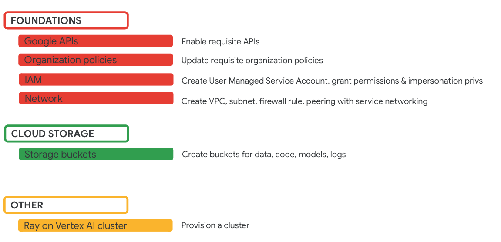

# Lab: Distributed sklearn on Ray

Ray parallelizes sklearn and you can find documetation from the Ray community [here](https://docs.ray.io/en/latest/ray-more-libs/joblib.html#ray-joblib).

## 1. About the lab

The lab offers a minimum viable/functionally adequate sample of distributed sklearn on Ray on Vertex AI. The lab aims to demystify the product, contributions are welcome for improvements.

### Module Listing

| # | About | 
| -- | :--- |    
| 01 |  [Provisioning Ray on Vertex](../00-common/Module-00-Provisioning.md) | 
| 02 |  [Baseline sklearn model training without Ray](module-01-baseline-sans-ray-README.md) | 
| 03 |  [Primer on ray.data with Cloud Storage](module-02-ray-data-gcs-primer-README.md) | 
| 04 |  [Primer on ray.data with BigQuery](module-03-ray-data-bq-primer-README.md) | 
| 05 |  [Primer on distributed sklearn with Ray on Vertex](module-04-ray-train-sklearn-primer-README.md) | 
| 06 |  [Training a sklearn RandomForest Classifier on Ray on Vertex in an interactive mode on a Colab notebook](module-05-ray-train-sklearn-interactive-README.md) | 
| 07 |  [Training a sklearn RandomForest Classifier on Ray on Vertex with the ray job API](module-06-ray-train-sklearn-job-api-README.md) | 
| 08 |  [Online serving with Vertex AI predictions](module-07-ray-train-sklearn-serve-online-vertex-endpoint-README.md) | 
| 09 |  [Batch predictions with BQML](module-08-ray-train-sklearn-serve-batch-bqml-README.md) | 
| 10 |  [Hyperparameter tuning with ray.tune - COMING SOON]() | 
| 11 |  [Batch inferencing with ray.data - COMING SOON]() | 

### 1.1. Use Case

   
  

### 1.2. What is showcased?

   
  

## 2. Setting up the lab environment

Disclaimer: At the time of creation of this lab (Feb-Mar 2024), the cluster provisioned via the UI had ray 2.4, while the SDK offered ray 2.9, and the Colab runtime template created by the Ray cluster had ray 2.9. Adjustments have been made in the lab for ray 2.4 to be consistent as the version across colab and the cluster. 

### 2.1. What's involved?

   
  

### 2.2. What gets provisioned?

   
  

### 2.3. Instructions for provisioning & smoke testing

Follow each step in the sequence laid out in the [instructions](../00-common/Module-00-Provisioning.md)

### 2.4. Time taken

~30 minutes

## 3. Lab Modules

### Module 1: Baseline model training without ray

Duration: 90 minutes or < | [Lab guide](module-01-baseline-sans-ray-README.md)

   
  

   
  

   
  

### Module 2: ray.data Google Cloud Storage primer

Duration: 5 minutes or < | [Lab guide](module-02-ray-data-gcs-primer-README.md)

   
  

   
  

### Module 3: ray.data BigQuery primer

Duration: 5 minutes or < | [Lab guide](module-03-ray-data-bq-primer-README.md)

   
  

   
  

### Module 4: Distributed sklearn on Ray - primer

Duration: 5 minutes or < | [Lab guide](module-04-ray-train-sklearn-primer-README.md)

   
  

   
  

### Module 5: Interactive distributed sklearn Random Forest Classification on Ray

Duration: 10 minutes or < | [Lab guide](module-05-ray-train-sklearn-interactive-README.md)

   
  

   
  

### Module 6: Distributed sklearn Random Forest Classification job on Ray

Duration: 10 minutes or < | [Lab guide](module-06-ray-train-sklearn-job-api-README.md)

   
  

   
  

### Module 7: Online predictions with Vertex AI predictions

Duration: 60 minutes or < | [Lab guide](module-07-ray-train-sklearn-serve-online-vertex-endpoint-README.md)

   
  

   
  

### Module 8: Batch predictions with BQML

Duration: 5 minutes or < | [Lab guide](module-08-ray-train-sklearn-serve-batch-bqml-README.md)

   
  

   
  

### Module 9: Terminating the lab environment

If you are done with the lab, dont forget to terminate the environment. 

Duration: 5 minutes or < | [Lab guide](module-end.md)

