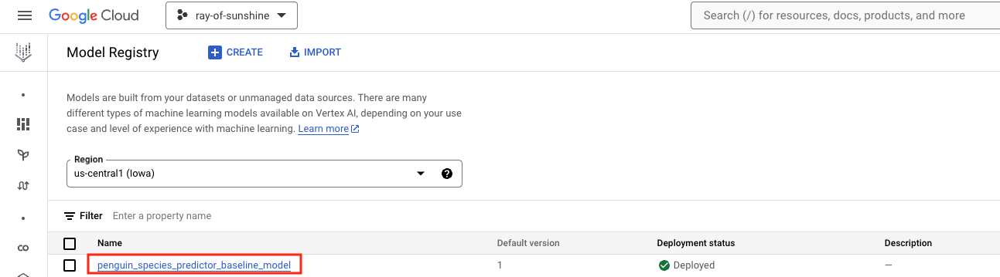

# Module 01: Baseline - Training and serving a basic sklearn model on Vertex AI (no Ray)

## 1. About the module

The notebook for this module is a baseline training experiment with Scikit-Learn- and without Ray. The subsequent modules that cover Ray, will not include the level of detail in the area of Exploratory Data Analysis as in this module. This module also serves as a primer to BigQuery, Vertex AI and batch inferencing with BigQuery ML (BQML) if you are unfamiliar with the same.

### 1.1. Content covered

This notebook for this module includes an end to end sample for -

1. Training a Scikit-Learn Random Forest Classifier model
2. Registering the model in Vertex AI model registry
3. Operationalizing the model for online predictions with Vertex AI endpoints
4. Online inferencing from Python with Vertex AI online serving
5. Batch infernencing in BQML
   
It includes the following steps:
1. Curating the training data source in BigQuery
2. Profiling the data
3. Exploratory data analysis
4. Feature engineering
5. Model training
6. Model registration into Vertex AI Model Registry
7. Deployment of model to Vertex AI Endpoint
8. Online inferencing
9. Registering a model trained elsewhere in BQML
10. Batch inferencing with BQML

### 1.2. Lab module use case

   
  

### 1.3. Lab module flow

   
  

### 1.4. Lab module solution architecture

   
  

### 1.5. Lab module prerequisites

[The provisioning lab module](https://github.com/anagha-google/ray-labs/blob/main/00-common/Module-00-Provisioning.md)

### 1.6. Lab module duration

90 minutes - largely due to time taken to deploy model to Vertex AI endpoint.

## 2. Getting started

### 2.1. Upload notebooks in the lab to Colab enterprise.

`git clone` the lab or zip download the git repo for the lab and upload as shown below.

   
  

   
  

   
  

   
  

   
  

## 3. The lab

### 3.1. Lab guide

Switch to the notebook and run all the steps. Switch back to this guide to see screenshots.

### Step 7 - Register the model into Vertex AI Model Registry

Reviewing model registration in Vertex AI Model Registry

   
  

   
  

### Step 8.1 - Create an endpoint resource in Vertex AI for online serving

   
  

   
  

### Step 8.2 - Deploy the model to the endpoint resource Vertex AI for online serving

   
  

### Step 9.3 - Imported model in BQML

   
  

This concludes the module. In subsequent modules, we will get into Ray for distributed sklearn. Proceed to the [next module](https://github.com/anagha-google/ray-labs/blob/main/01-sklearn/module-02-ray-data-gcs-primer-README.md).

