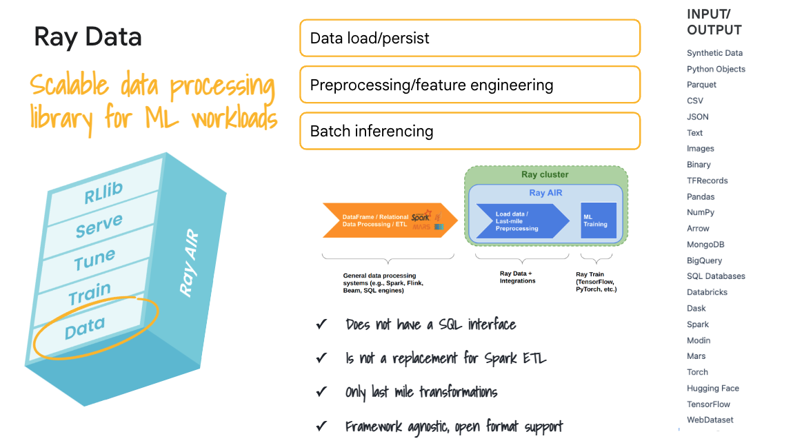
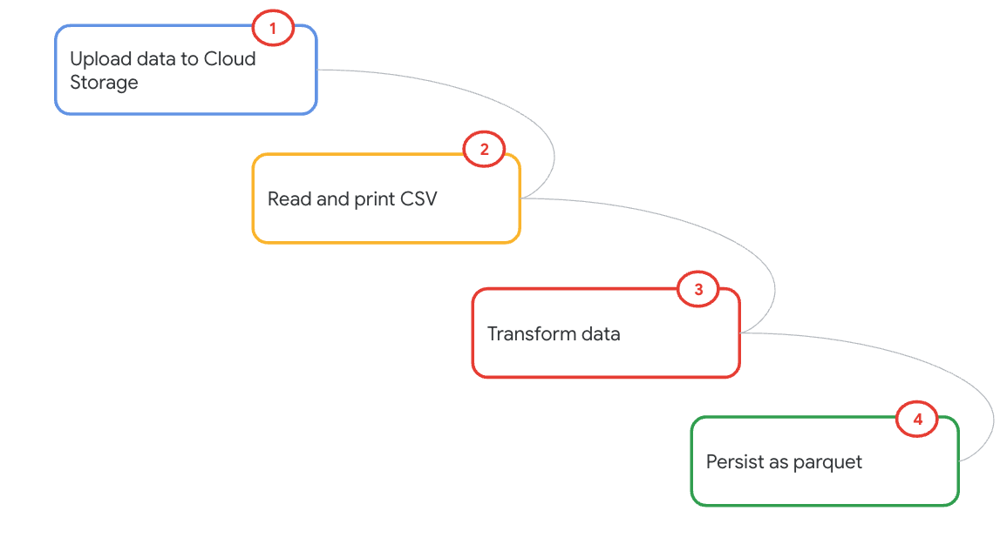
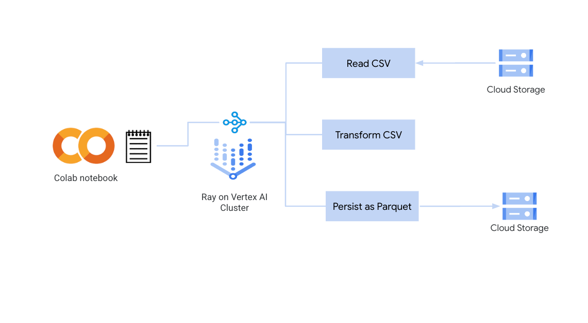
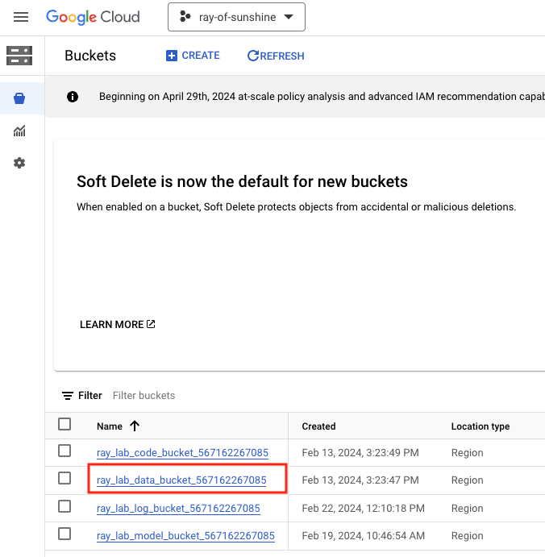
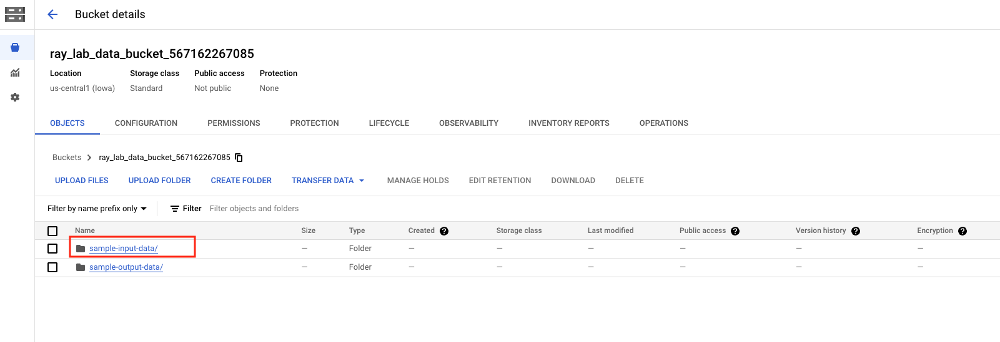
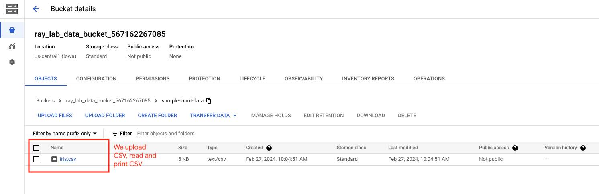
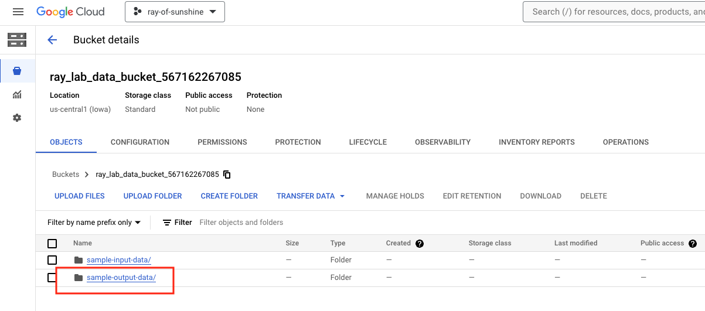
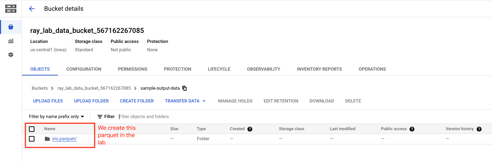
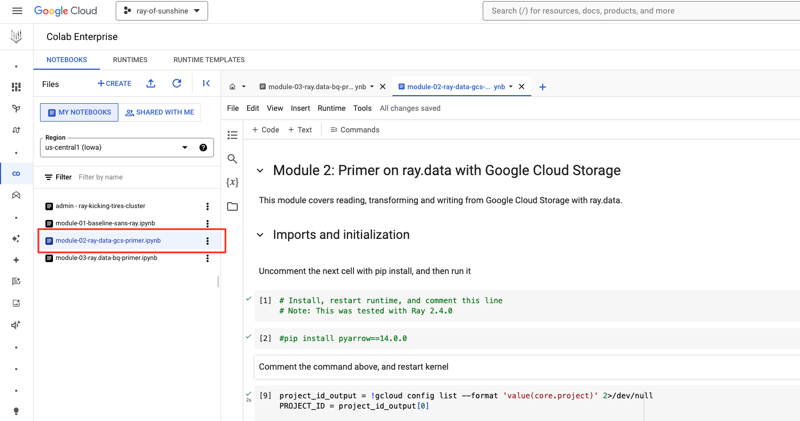

# Module 02: **ray.data** primer for interacting with Google Cloud Storage

## 1. About the module
The notebook for this module demonstrates using ray.data for reading, transforming and writing to Google Cloud Storage. 

<hr>

### 1.1. Content covered

1. Uplaod data to Google Cloud Storage
2. Install compaible version of PyArrow compatible with Ray version on Ray on Vertex cluster
3. Read CSV data in GCS with ray.data 
4. Transform data with ray.data 
5. Persist data with ray.data  as parquet

<hr>
 
### 1.2. About ray.data

ray.data is a library in Ray AIR fit for purpose for reading, writing data, for feature engineeringf at scale, last mile transformations and batch inferencing at scale. Learn more at ray.io.

   
<br><br>

<hr>

### 1.3. Lab module flow

   
<br><br>

<hr>

### 1.4. Lab module solution architecture

   
<br><br>

<hr>

### 1.5. Lab module duration

5 minutes

<hr>

### 1.6. Lab module pre-requisites

Completion of prior lab modules.

<hr><hr>

## 2. Lab

### 2.1. Getting started
Upload the notebook - module-02-ray-data-gcs-primer.ipynb to your colab workspace as done in module 1.

<hr>

### 2.2. Upload data to Cloud Storage bucket 

#### 2.2.1. Upload CSV data

Paste in Cloud Shell scoped to your project-
```
PROJECT_ID=`gcloud config list --format "value(core.project)" 2>/dev/null`
PROJECT_NBR=`gcloud projects describe $PROJECT_ID | grep projectNumber | cut -d':' -f2 |  tr -d "'" | xargs`

cd ~/ray-labs/00-common/data/iris

gsutil cp iris.csv gs://ray_lab_data_bucket_$PROJECT_NBR/sample-input-data/
```

Validate in the Cloud Console GCS UI-

   
<br><br>

   
<br><br>

   
<br><br>

<hr>

#### 2.2.2. Visual of data we persist from the lab

   
<br><br>

   
<br><br>


<hr>

#### 2.3. Get started

Move over to the Colab notebook environment - module-02-ray-data-gcs-primer.ipynb - and run through the lab module.

   
<br><br>


<hr><hr>

This concludes the lab module. Proceed to the [next module](https://github.com/anagha-google/ray-labs/blob/main/01-sklearn/module-03-ray-data-bq-primer-README.md).

<hr><hr>
