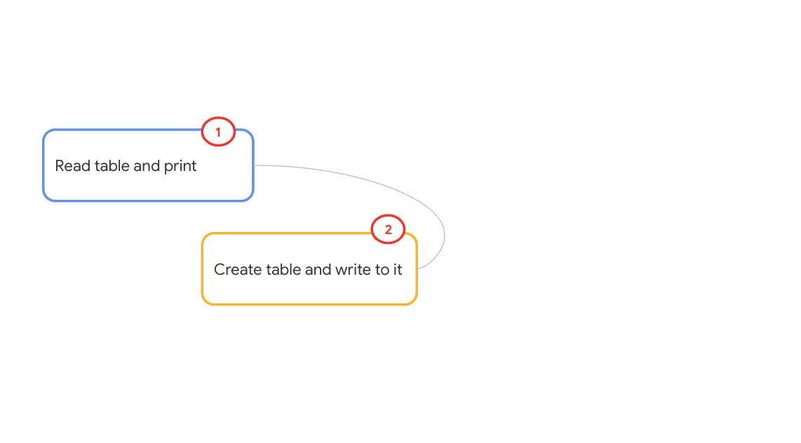

# Module 03: **ray.data** primer for interacting with BigQuery

## 1. About the module
The notebook for this module demonstrates using ray.data for reading, and writing to BigQuery. 

### 1.1. Content covered

1. Reading a BigQuery native table with ray.data
2. Creating and writing to a BigQuery native table with ray.data

 
### 1.2. Lab module flow

   
  

### 1.3. Lab module solution architecture

   
  

### 1.4. Lab module duration

5 minutes

### 1.5. Lab module pre-requisites

Completion of prior lab modules.

## 2. Lab

### 2.1. Import lab module notebook into Colab
Upload the notebook - module-03-ray-data-bq-primer.ipynb to your colab workspace as done in module 1.

### 2.2. Follow along and visit Bigquery UI to see results

   
  

   
  

### 2.3. Get started

Move over to the Colab notebook environment - module-03-ray-data-bq-primer.ipynb - and run through the lab module.

   
  

This concludes the lab module. Proceed to the [next module](https://github.com/anagha-google/ray-labs/blob/main/01-sklearn/module-04-ray-train-sklearn-primer-README.md).

