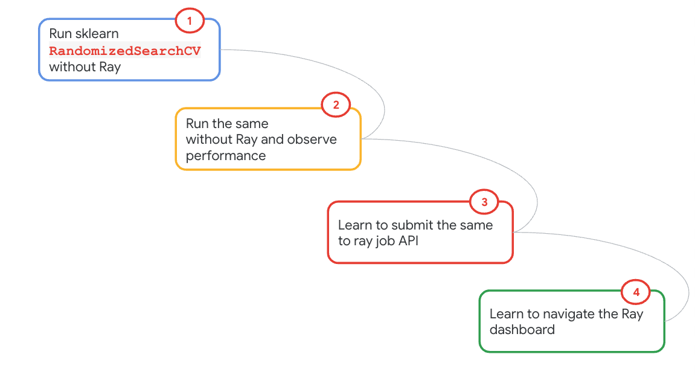
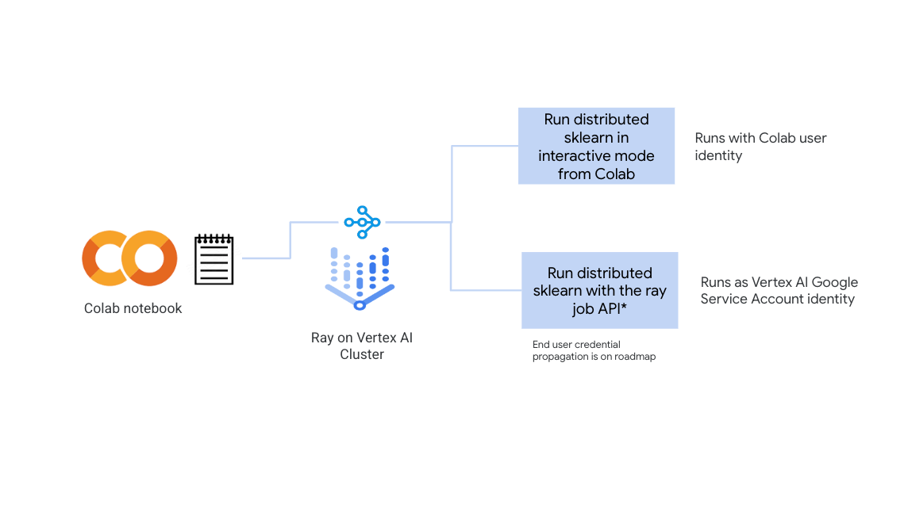
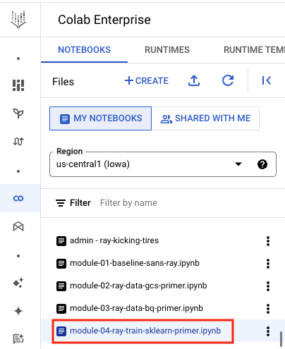
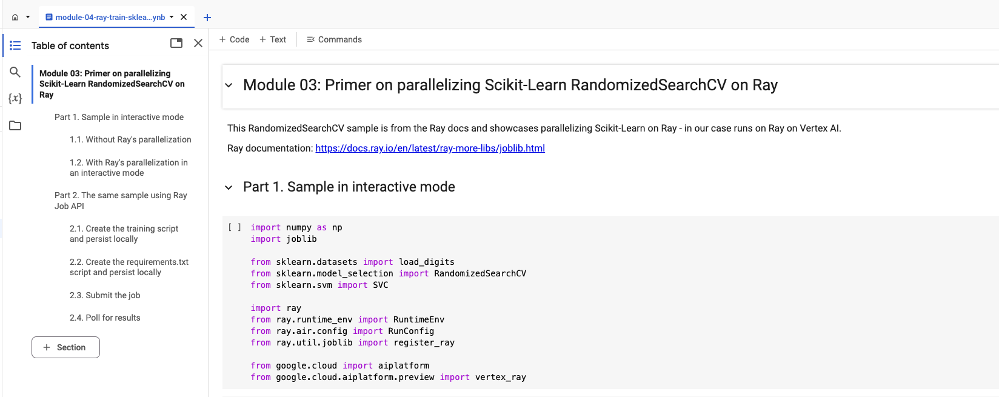
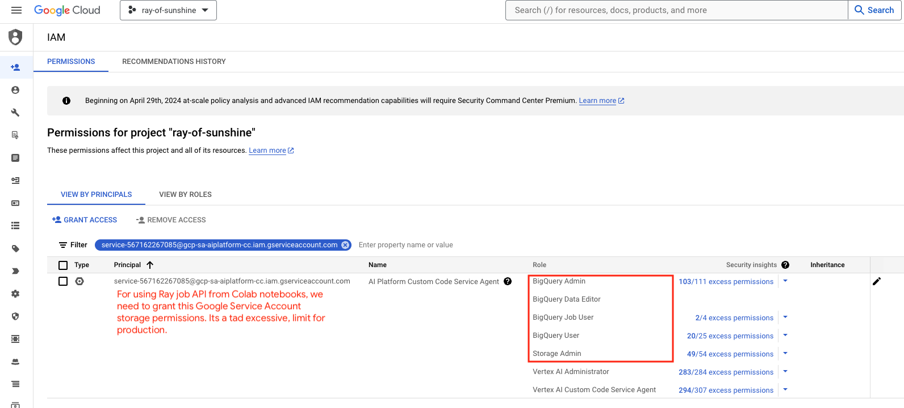
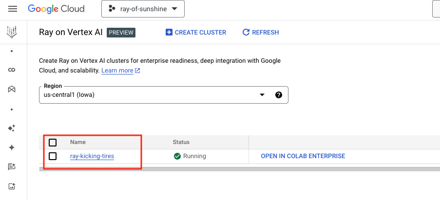

# Module 04: Primer for distributed sklearn with Ray

## 1. About the module
The notebook for this module demonstrates using ray's out of the box feature for scaling sklearn. The sample is straight out of the docs from [ray.io](https://docs.ray.io/en/latest/ray-more-libs/joblib.html).

### 1.1. Content covered

1. Running sklearn sample without Ray's parallelization
2. Running the same sample with Ray for distributing the work
3. Review the performance improvement with using Ray
4. Navigate to the Ray dashboard and review execution

 
### 1.2. Lab module flow

   
  

### 1.3. Lab module solution architecture

   
  

### 1.4. Lab module duration

5 minutes

### 1.5. Lab module pre-requisites

Completion of prior lab modules.

## 2. Lab

### 2.1. Import lab module notebook into Colab
Upload the notebook - module-04-ray-train-sklearn-primer.ipynb to your colab workspace as done in module 1.

### 2.2. Get started

Move over to the Colab notebook environment - module-04-ray-train-sklearn-primer.ipynb - and run through the lab module.

   
  

### 2.3. Ray dashboard for reviewing job execution

   
  

   
  

   
  

This concludes the lab module. Proceed to the [next module](https://github.com/anagha-google/ray-labs/blob/main/01-sklearn/module-05-ray-train-sklearn-interactive-README.md).

