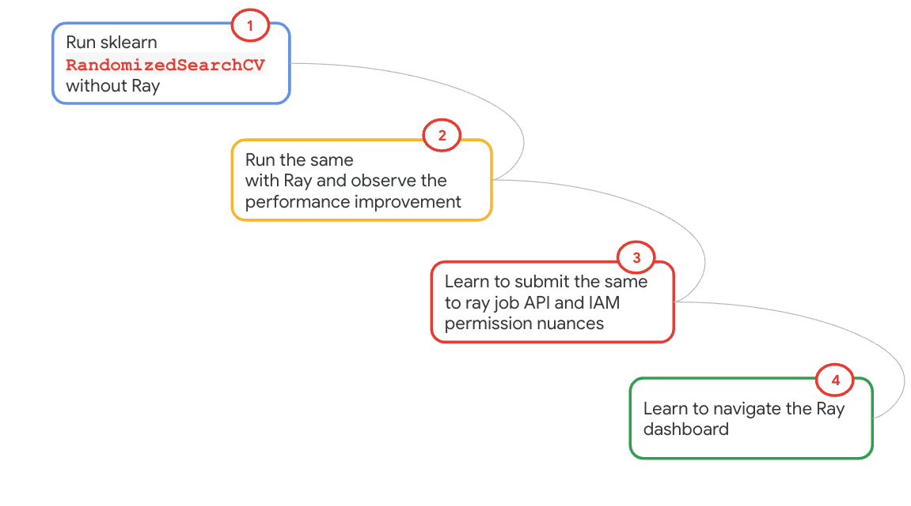
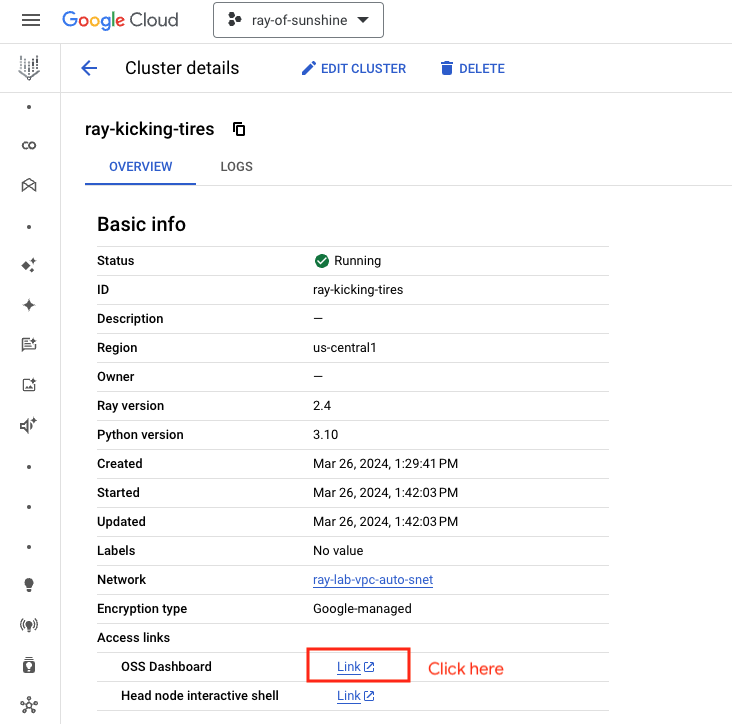
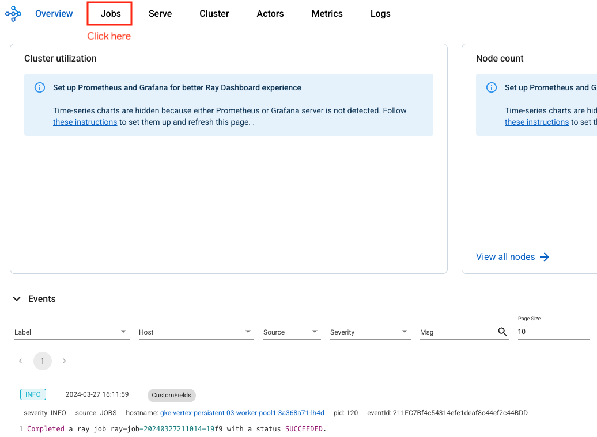
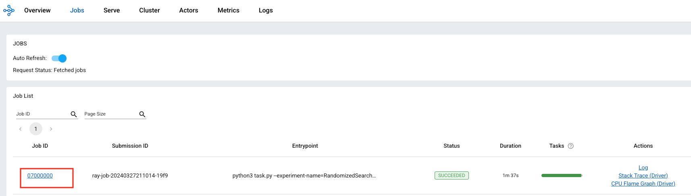
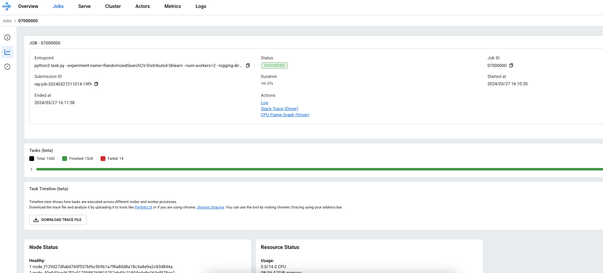
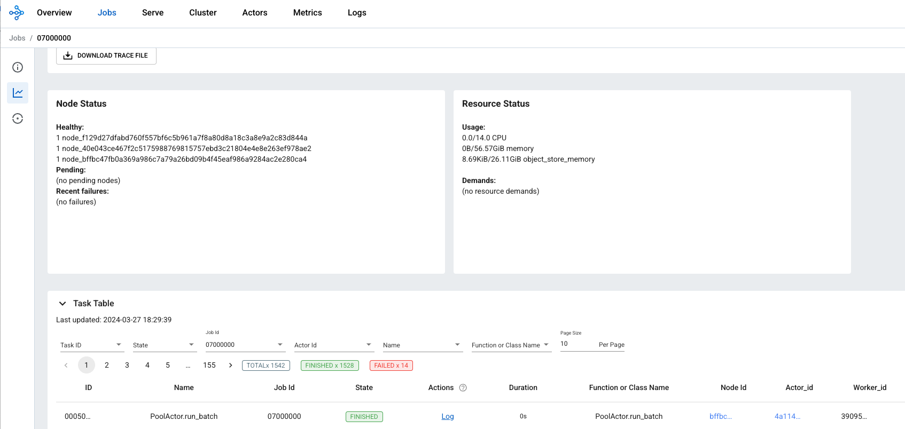
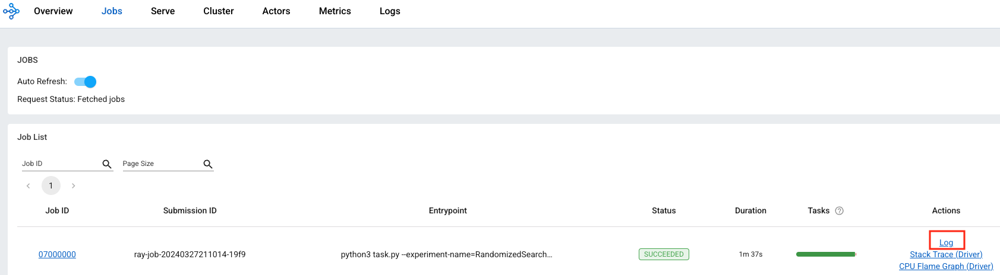
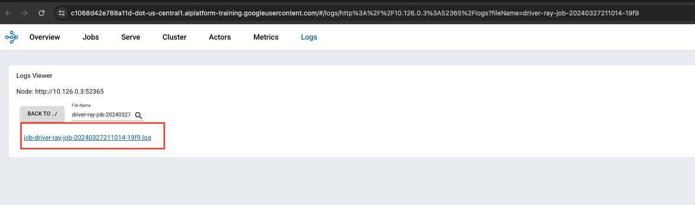
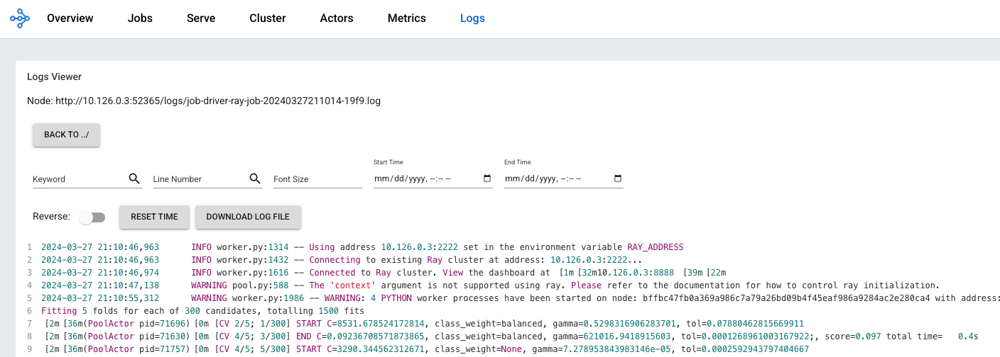

# Module 04: Primer for distributed sklearn with Ray

## 1. About the module
The notebook for this module demonstrates using ray's out of the box feature for scaling sklearn. The sample is straight out of the docs from [ray.io](https://docs.ray.io/en/latest/ray-more-libs/joblib.html).

### 1.1. Content covered

1. Running sklearn sample without Ray's parallelization - takes ~5 minutes
2. Running the same sample with Ray for distributing the work - takes ~1 minute
3. Reflect on the performance improvement with using Ray, and the simplicity of seamlessly scaling sklearn across workers!
4. Learn how to submit a job to Ray job API and understand the IAM permissions nuances with Ray on Vertex AI as it stands.
5. Navigate to the Ray dashboard and review execution

 
### 1.2. Lab module flow

   
  

### 1.3. Lab module solution architecture

   
  

### 1.4. Lab module duration

5 minutes

### 1.5. Lab module pre-requisites

Completion of prior lab modules.

## 2. Lab

### 2.1. Import lab module notebook into Colab
Upload the notebook - module-04-ray-train-sklearn-primer.ipynb to your colab workspace as done in module 1.

### 2.2. Ray job API nuances

As of the authoring of this lab (March 2024), Ray on Vertex jobs submitted via Colab run as the Vertex AI service account - and therefore it needs access to storage systems as shown below. These permissions were applied as part of provisioning early on.

   
  

### 2.3. Get started

Move over to the Colab notebook environment - module-04-ray-train-sklearn-primer.ipynb - and run through the lab module.

   
  

   
  

### 2.3. Ray dashboard for reviewing job execution

   
  

   
  

   
  

   
  

   
  

   
  

   
  

   
  

   
  

This concludes the lab module. Proceed to the [next module](https://github.com/anagha-google/ray-labs/blob/main/01-sklearn/module-05-ray-train-sklearn-interactive-README.md).

