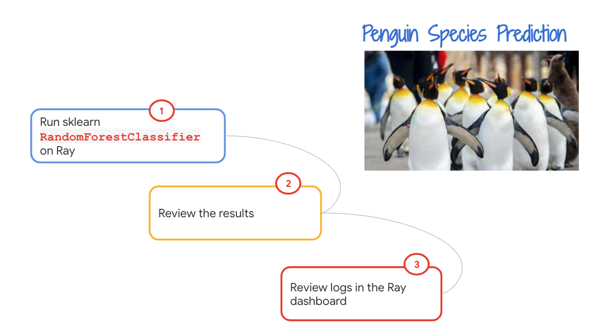
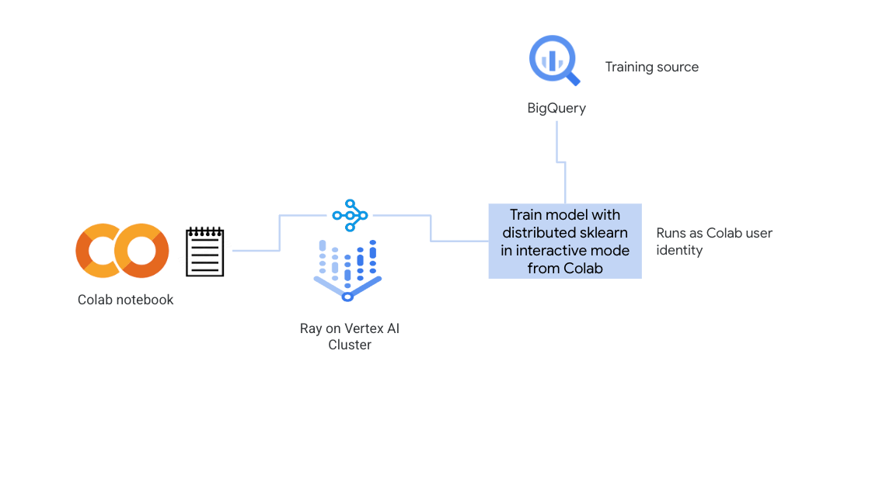
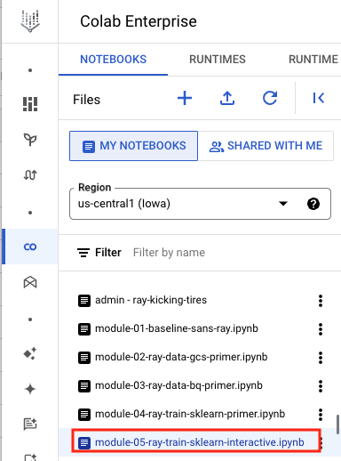
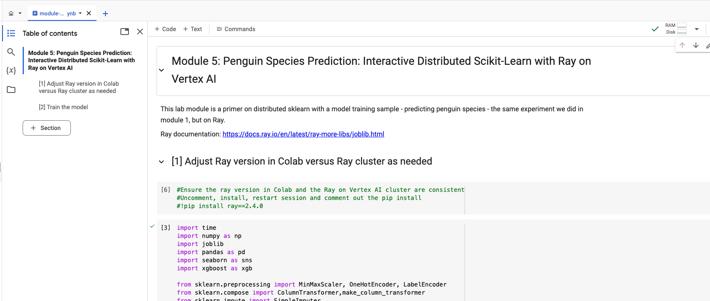
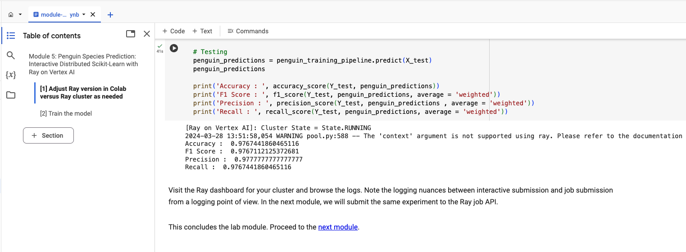

# Module 05: Distributed sklearn on Ray on Vertex AI in interactive mode

## 1. About the module
The notebook for this module demonstrates using ray's out of the box feature for scaling sklearn in an interactive mode, with a minimum viable experiment - penguin species prediction with sklearn RandomForestClassification algorithm, on Ray on Vertex AI. At the time of the authroing of this lab, the version of Ray with cluesters created via UI was Ray 2.4.

### 1.1. Content covered

Training sklearn Random Forest Classifier with Ray for parallelization

 
### 1.2. Lab module flow

   
  

### 1.3. Lab module solution architecture

   
  

### 1.4. Lab module duration

5 minutes

### 1.5. Lab module pre-requisites

Completion of prior lab modules.

## 2. Lab

### 2.1. Import lab module notebook into Colab
Upload the notebook - module-05-ray-train-sklearn-interactive.ipynb to your colab workspace as done in module 1.

   
  

### 2.2. Get started

Move over to the Colab notebook environment - module-05-ray-train-sklearn-interactive.ipynb - and run through the lab module.

   
  

   
  

### 2.3. Ray dashboard for reviewing job execution

Visit the Ray dashboard and review logs.

This concludes the lab module. Proceed to the [next module](module-06-ray-train-sklearn-job-api-README.md).

