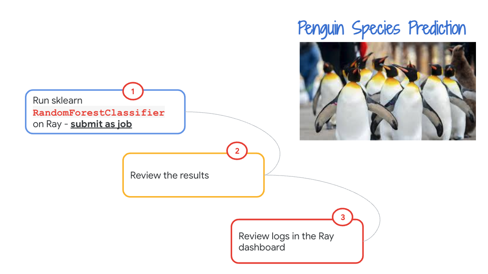
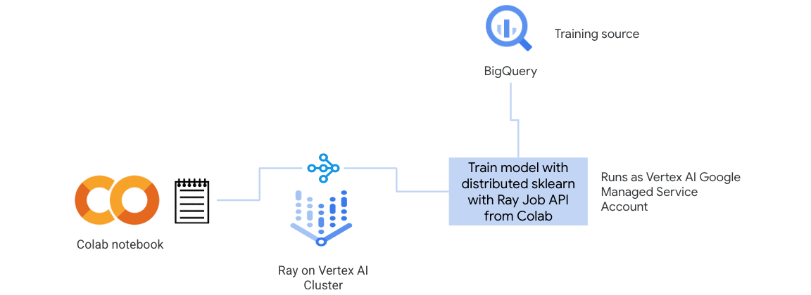
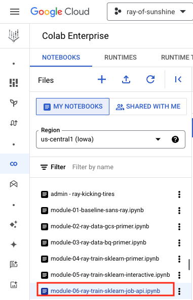
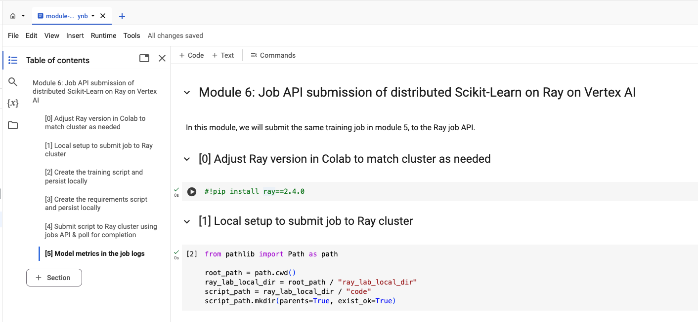
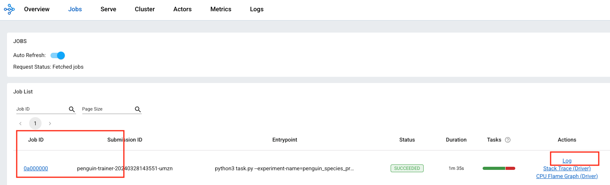
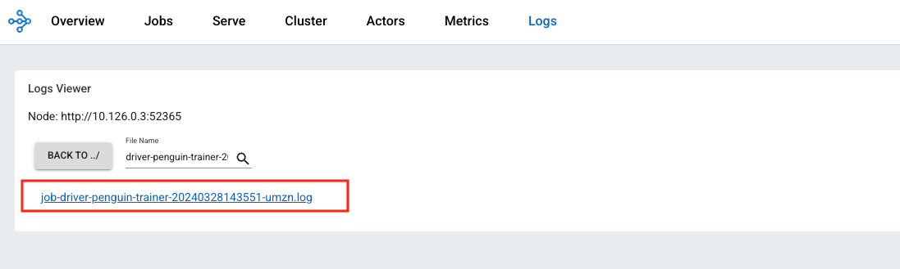
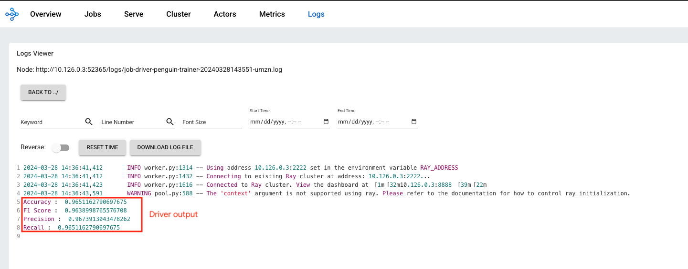

# Module 06: Distributed sklearn on Ray on Vertex AI with Ray Job API

## 1. About the module
The notebook for this module demonstrates submitting the same model training we did in lab module 5, but to the Ray job API, instead of interactive model training. This is how model training is operationalized for production.

### 1.1. Content covered

1. Training sklearn Random Forest Classifier with Ray for parallelization bu submitting the training as a job to the Ray job API.
2. Navigating the dashboard to get to the driver log for output of the job.

 
### 1.2. Lab module flow

   
  

### 1.3. Lab module solution architecture

   
  

### 1.4. Lab module duration

5 minutes

### 1.5. Lab module pre-requisites

Completion of prior lab modules.

## 2. Lab

### 2.1. Import lab module notebook into Colab
Upload the notebook - module-06-ray-train-sklearn-job-api.ipynb to your colab workspace as done in module 1.

   
  

### 2.2. Get started

Move over to the Colab notebook environment - module-06-ray-train-sklearn-job-api.ipynb - and run through the lab module.

   
  

### 2.3. Ray dashboard for reviewing job execution

Visit the Ray dashboard and review job logs. Navigate to the driver logs to see the output of the job.

   
  

   
  

   
  

This concludes the lab module. Proceed to the [next module](module-07-ray-train-sklearn-serve-online-vertex-endpoint-README.md).

