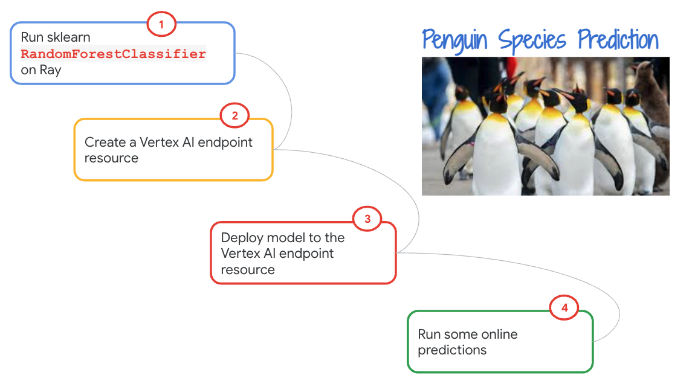
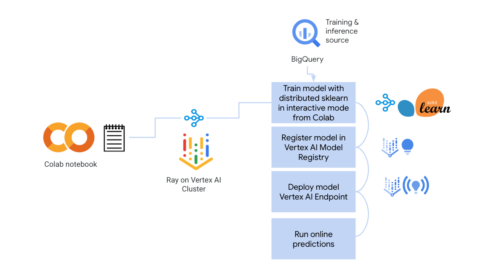
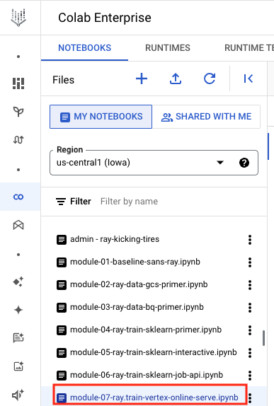
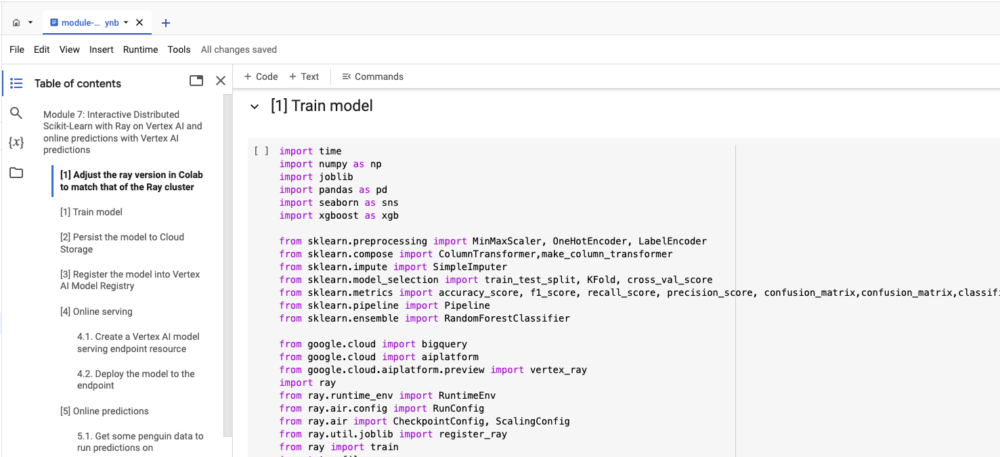
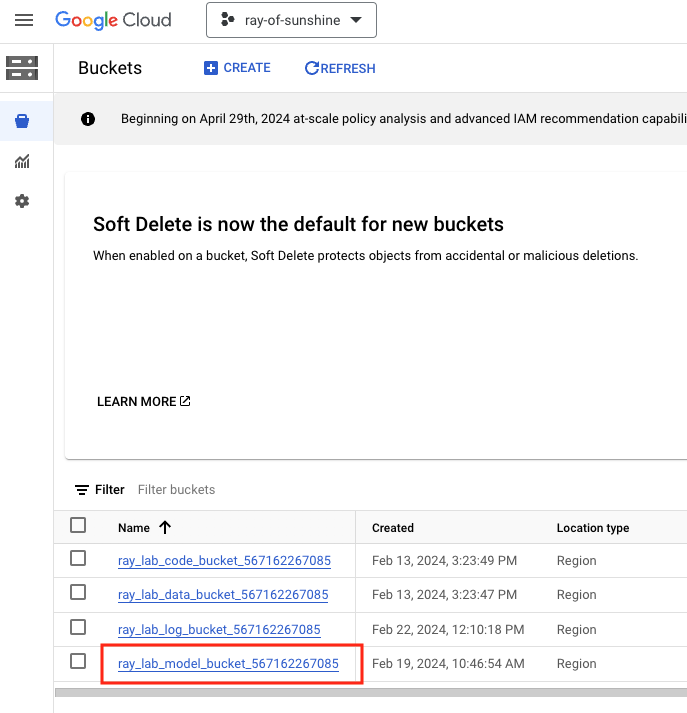
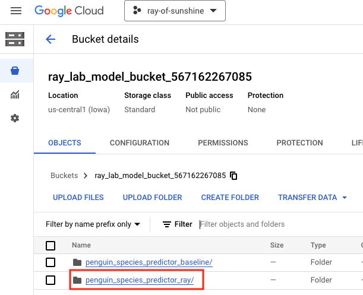
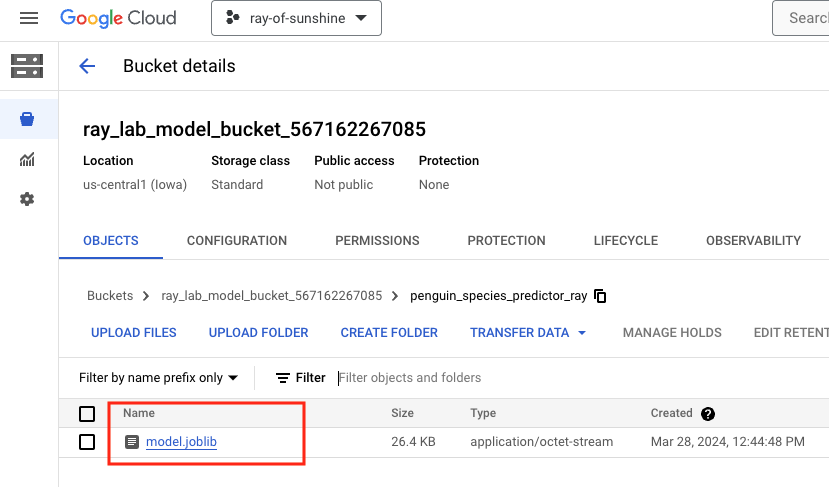
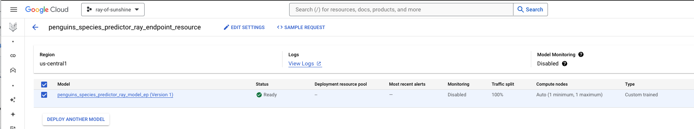

# Module 07: Distributed sklearn on Ray on Vertex AI with online serving

## 1. About the module
The notebook for this module demonstrates submitting the same model training we did in lab module 5, but to the Ray job API, instead of interactive model training. This is how model training is operationalized for production.

### 1.1. Content covered

1. Same Random Forest Classifer model on Ray, with the addition of using sklearn pipeline
2. Registering model in Vertex AI Model Registry
3. Creating a Vertex AI Endpoint Resource
4. Deploying model to Vertex AI Endpoint Resource
5. Running online predictions

 
### 1.2. Lab module flow

   
  

### 1.3. Lab module solution architecture

   
  

### 1.4. Lab module duration

90 minutes or less depending on how quickly the Vertex AI endpoint resource is created

### 1.5. Lab module pre-requisites

Completion of prior lab modules.

## 2. Lab

### 2.1. Import lab module notebook into Colab
Upload the notebook - module-07-ray-train-sklearn-serve-online-vertex-endpoint.ipynb to your colab workspace as done in module 1.

   
  

### 2.2. Get started

Move over to the Colab notebook environment - module-07-ray-train-sklearn-serve-online-vertex-endpoint.ipynb - and run through the lab module. This lab guide has visuals for better understanding and following along. Switch back and forth if it helps on complete a quick read of this lab guide before heading over to the lab notebook.

   
  

### 2.3. Vertex AI model persisted to Cloud Storage

   
  

   
  

   
  

### 2.4. Vertex AI model registry

   
  

### 2.5. Vertex AI model endpoint resource

   
  

### 2.6. Vertex AI model endpoint for online serving

   
  

This concludes the lab module. Proceed to the [next module](module-08-ray-train-sklearn-serve-batch-bqml-README.md).

