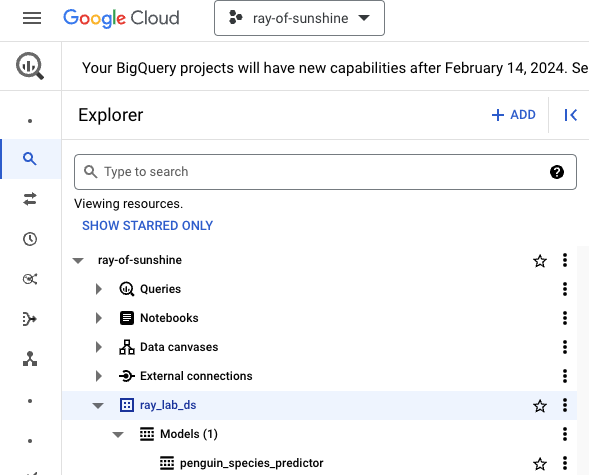

# Module 10: Batch inferencing with BQML

## 1. About the module
The notebook for this module demonstrates importing a sklearn model trained on Ray into BQML and doing batch inferencing with BQML. This is an optional patterm for inferencing if the data is structured.

### 1.1. Content covered

1. Same Random Forest Classifer model training on Ray
2. Persisting the model to ONNX format
3. Importing the  model into BQML
4. Batch inferencing with BQML

 
### 1.2. Lab module flow

   
  

### 1.3. Lab module solution architecture

   
  

### 1.4. Lab module duration

10 minutes or less 

### 1.5. Lab module pre-requisites

Completion of prior lab modules.

## 2. Lab

### 2.1. Import lab module notebook into Colab
Upload the notebook - module-08-ray-train-sklearn-serve-batch-bqml.ipynb to your colab workspace as done in module 1.

   
  

### 2.2. Get started

Move over to the Colab notebook environment - module-08-ray-train-sklearn-serve-batch-bqml.ipynb and run through the lab module. This lab guide has visuals for better understanding and following along. Switch back and forth if it helps on complete a quick read of this lab guide before heading over to the lab notebook.

   
  

### 2.3. Model in BigQuery

   
  

### 2.4. Batch inferencing in BigQuery

   
  

This concludes the lab module. Proceed to the [next module](module-end.md).

