# Scalable Machine Learning with Ray on Vertex AI

This repository has minimum viable samples of distributed machine learning with Ray on Vertex AI including integration with relevant Google Cloud services. It is meant to be an easy read to demystify Ray on Vertex AI, and for those partial to trying the product, this repo provides quickstart samples.

## 1. About Ray

Ray is popular open source technology for scaling machine learning. Learn in depth about Ray at [ray.io](https://docs.ray.io/en/latest/index.html).

### 1.1. What is Ray?

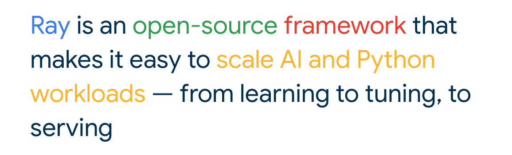   
  

### 1.2. Use cases for scaling with Ray

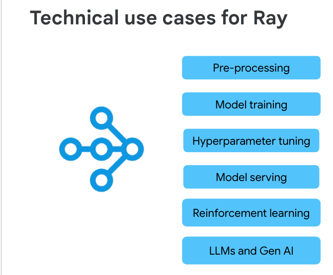   
  

### 1.3. Who can benefit from Ray?

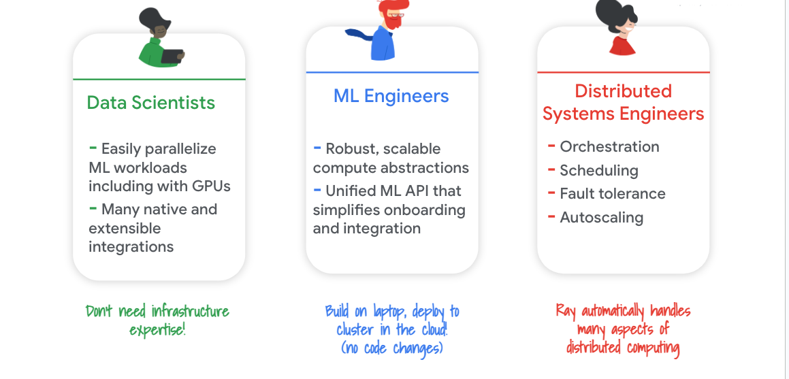   
  

### 1.4. What's in the Ray stack?

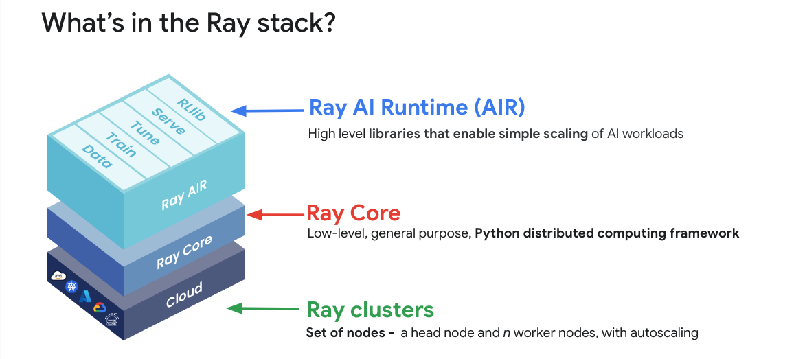   
  

### 1.5. What is Ray AIR?

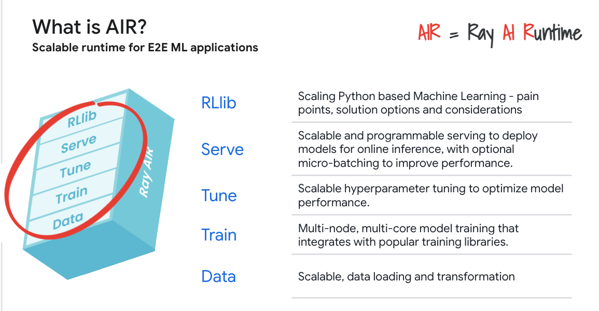   
  

### 1.6. The ray repo

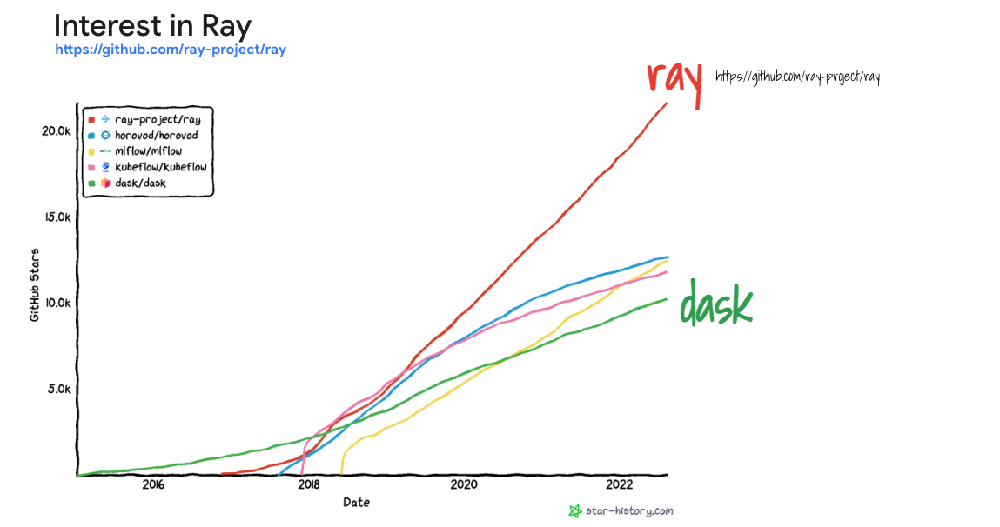   
  

### 1.7. Options for Ray on Google Cloud

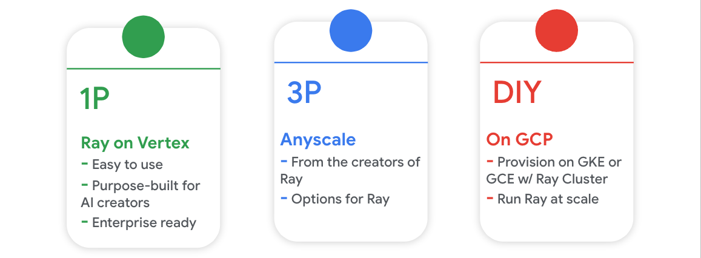   
  

## 2. Ray on Vertex AI (RoV)

### 2.1. About RoV

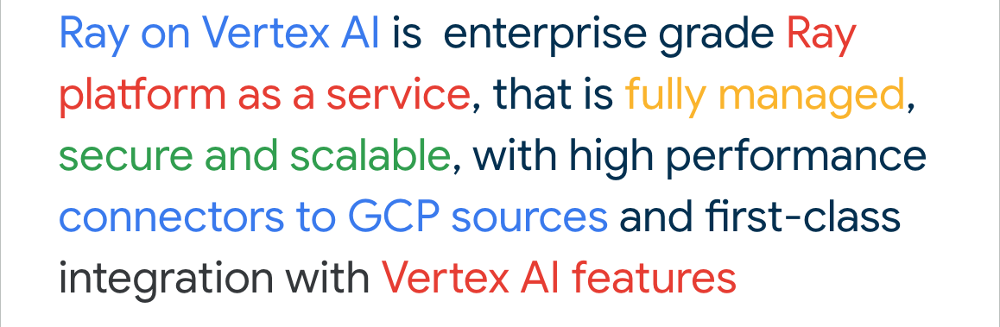   
  

### 2.2. Getting started

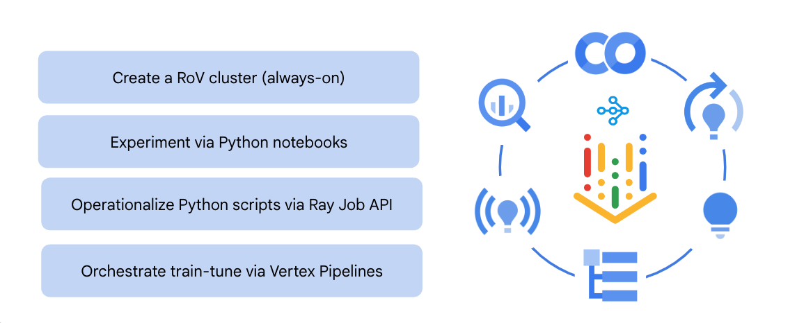   
  

### 2.3. RoV architecture

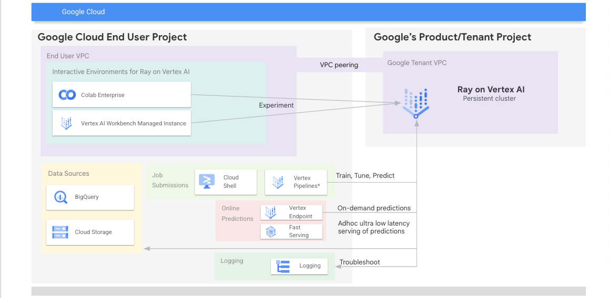   
  

### 2.4. Provisioning RoV - options

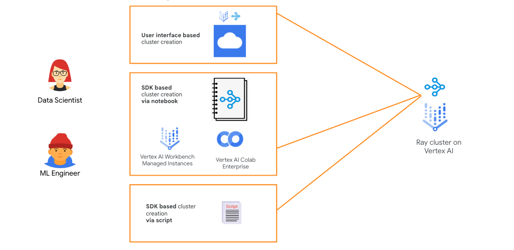   
  

### 2.5. Architectural considerations

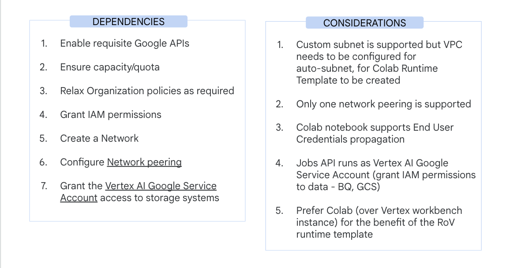   
  

### 2.6. Experimenting - Model Training, Tuning 

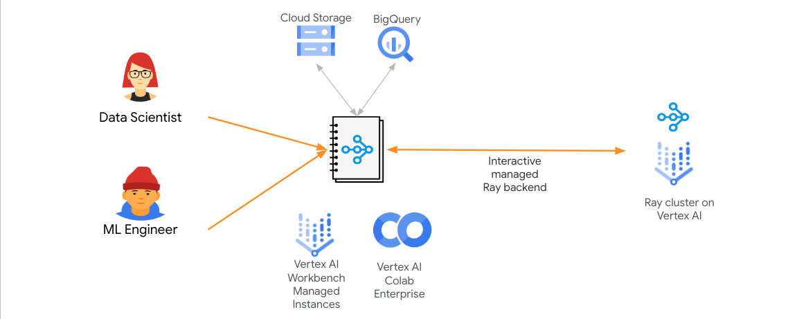   
  

### 2.7. Operationalizing - Model Training, Tuning 

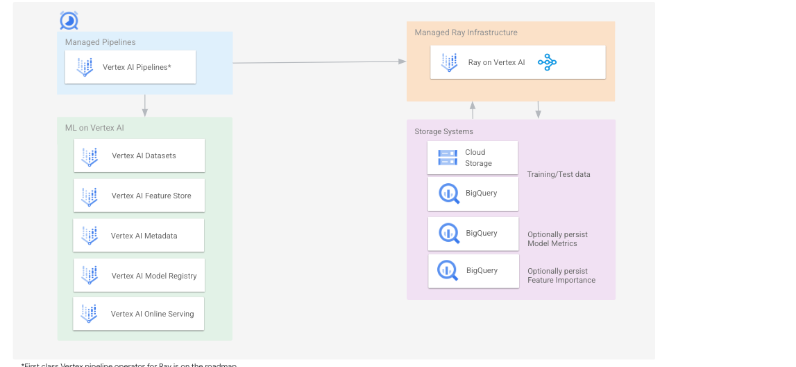   
  

### 2.8. Predictions

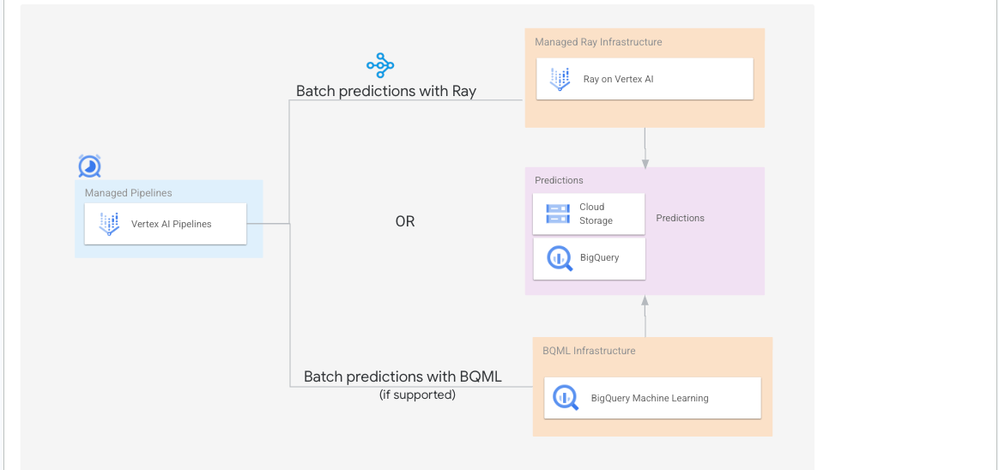   
  

## 3. Resources

### 3.1. Documentation

[Technology: Ray](https://ray.io) 
[Product: Ray on Vertex AI](https://cloud.google.com/vertex-ai/docs/open-source/ray-on-vertex-ai/overview)

### 3.2. Hands on Labs

| # | About | Author | 
| -- | :--- | :--- |   
| [01](https://github.com/GoogleCloudPlatform/vertex-ai-samples/blob/main/notebooks/official/ray_on_vertex_ai/get_started_with_pytorch_rov.ipynb) |  Pytorch on Ray on Vertex | Ivan Nardini - Feb 2024 |
| [02](01-sklearn/README.md) |  Scikit-Learn on Ray on Vertex | Anagha Khanolkar - Mar 2024 |

## Credits & Contribution

This repository is (Google) community contributed by Ray enthusiasts. Feel free to contribute code or log issues to this repo.

Samples may be heavily influenced by/or an adaptation of samples from ray.io

